# MyTodoWebApplication_on_AWS 作成プロジェクトについて

## 1. プロジェクトの取組み方について
### 1.1 プロジェクトの目的
当プロジェクトは独自のTodアプリをインフラ、コンテナ、データベース、バックエンド、フロントエンドの各コンポーネントの理解を深め、ある企業の新規開発案件を想定して取り組む。<br>
それを踏まえ、学習における目的、及び商品として(革新的なTodoアプリケーションを開発しTodoアプリの歴史を塗り替えることを目論む)の目的と2つの観点の目的を制定した。
これを、以下の通り定義する。

### 1.1.1 学習目的
  拡張性やクラウドサービスとの相性の良さから昨今マイクロサービスアーキテクチャが台頭してきており、実際に大手のメガベンチャーやGAFAといった名だたる企業が事例として効果を上げていることはよく耳にする。<br>
  <br>
  そのため、このプロジェクトでは、具体的にどのようにマイクロサービスアーキテクチャを実現するかをコンテナオーケストレーションのデファクトスタンダードツールであるKubernetesを用いた拡張性や耐障害性に秀でたアプリケーション基盤の構築、及び
  それをクラウドサービス上で構築しTerraformを用いたインフラストラクチャのコード化を実施することで、イミュータブルで可搬性が高く運用面でのメンテナンスコストが低いインフラ構築を実施する<br>
  <br>
  更に、当アーキテクチャ全体の全体像を網羅的に把握し、単一ではなくすべての要素が調和したうえで最適な実装を目指すべく、データベース実装、バックエンドAPIサーバーの構築、フロントエンドサーバーにて実際にユーザーがどういったUIに触れるのかまでをいわゆるフルスタック的に実装することで、それぞれのコンポーネントが持つ役割を理解しながら、それらを組み合わせた全体のアーキテクチャを理解することを目的とした<br>

### 1.1.2 商品目的
  - あるアプリケーション制作会社は、世の中のTodo管理ツールに疑問を感じていた。
  最初は勇んでTodoをアウトプットし、一時思考が整理されたのも束の間、気づけば未消化のタスクであふれかえる。
  タスクを追加するのはいいが前に作成したタスクに気持ちが向かず、優先順位も不明瞭なまま、なんとなくこなしていくも、積もり積もるタスクはどんどん増えるばかり
  しまいには、そのTodo管理ツールは使わなくなり、マルチタスクは非効率的!とわかっていても、思考は今あることに手一杯になって気づけば遅い時間まで残業を繰り返す。

  そんな、昨今のTodo管理ツールに対して、大いなる課題感とTodoの本質、並びにそれを使う人の本質を理解し、それを解決するための革新的なTodoアプリケーションを開発することを考えた。
  心理学を大学で専攻していたアプリケーション制作会社のエンジニアが主軸となり、まだ、エンジニアとしての経験は浅いものの世にあるTodo管理ツールではなく、
  あくまで脳科学的にも心理学的にも、人のパフォーマンスを最大限に発揮できるTodoアプリケーションの開発を目論んだのだ。
  まずはWebアプリケーションとしてリリースし、気になった人が手軽に使用できるようなものをリリースし、ユーザーカラーのフィードバックを招集。その後将来的には、改善を加えていきPCデスクトップアプリ及び、スマートフォン対応アプリへと媒体や提供手段を拡充していく、そしてこの革新的なTodoアプリケーションを世間のTodo管理に悩む全人類に提供をするように画策をしているのだった。  

### 1.1.3 目的策定の背景について
  よくある各コンポーネントを技術習得するための手段としては書籍やUdemy、qiita等サイトに掲載された情報からハンズオンでベーシックアプリケーションの構築、ビルドデプロイ手法の検討、環境構築を実施するものがある。<br>
<br>
  当初はそれらを何度も反復し技術習得に勤しんだが、その習得した技術がサービスとして構成されたときにどのように役立ちどう重要だったのかがわからず"実際に試してみたけど現場で活きない!すぐ忘れる!"ことがよくあった。<br>
  また多くの企業でサービスとして形成しているものと自身が手掛けたものの品質的乖離の大きさに対して辟易としてしまうことが多々あった。<br>

  そのため、以下の方針で取り組むこととした。<br>
  ①いわゆるフルスタック的に
  - WebサーバーによるWebページのルーティングやリバースプロキシ、SSL終端処理
  - フロントエンド開発言語によるSPAアプリのUIの構築
  - バックエンド開発言語によるAPIリクエストとレスポンスとデータベースコネクションと然るべきデータベースのクエリ実行
  - それらの実行基盤をコンテナオーケストレーションを使って拡張性や耐障害性に優れた基盤を構築
  - そのコンテナ基盤はクラウドサービスにIacを用いて作成することで高い拡張性とマネージドサービスを適切に連携させて運用負荷を軽減させた<br>
  
  そんな昨今のモダンアーキテクチャを踏襲したものを完成形とし、今日のモダンWebアプリケーションアーキテクチャに用いられるコンポーネントを複合。<br>
  いわゆる"フルスタック的"にアーキテクチャ全体を見通し各コンポーネントが持つ役割を理解しながら進める。<br>
  <br>
  ② 自身がタスクを遂行するときに｢こういうTodo管理手法がめちゃくちゃ効果的だった｣という実体験をもとに無機質なCRUD操作のチュートリアルのようなWebアプリケーションではなく、<br>
  自身がエンジニア(コードやアーキテクチャーの作成する人)、PM(ユーザーニーズをブレイクダウン、プロジェクト進捗や想定外事象への対応、予実管理する人)の立場を担いつつ自身が一番のお客様(ほしい商品とAsisTobeの言語化、導入目的を適切にPMと連携する人)の役割を担い、すべて自身の視点で監督し、**自身が使いたいと思えるようなTodo管理アプリケーション**を開発することを目指す。  

### 1.2 プロジェクトの取り組みスタンス
1. 完璧を求めない
   いうて初めての取り組みである。(にも関わらず、携わる領域が広いかつ難しいものが多い印象だが)
   そのため、作成するものは完璧である必要はなく、むしろ荒削りであっても、
   - 最低限セキュリティや秘密情報の扱いを適切に行いつつ
   - 機能を最低限に
   - やりたかったことを目指す
  <br>ようにすること
2. 指摘を恐れない<br>
   1.に関連するが、作成物に対して指摘があったときに、それを恐れず、その指摘を受け入れ、それをもとに改善を加えることを目指す。
   むしろ指摘をありがたいと思う。(誹謗中傷はできればやめてほしいが)
3. 誰かに良い影響を与えることを念頭にやる<br>
   自身のエンジニアとしての成長を考えるのもそうだが、この取り組みが、世界の何処かの喜びとなるようにアウトプットを見据えて実施する。
   どんなに粗悪な実装でも、その作成物が成長していく姿に勇気づけられる人。または、実装の仕方が参考になる人。
   そんな風に誰かの役にたち喜びを生んでいけるようなスタンスを目指す。
  

## 2. 作成したいアプリケーションについて

### 2.1 Todoアプリケーションの特徴
### 2.1.1 Todoアプリの概要説明


[参考](https://studyhacker.net/ivy-lee-method)

### 2.1.2 主要機能
1. 実施すべき項目欄(今日やるべきタスク)を設ける
1. やるべきタスクには6つのタスクを追加する枠がある。
1. やるべきタスクには6つ以上は登録できない。
1. やるべきタスクは最上段だけがライトアップされそれ以外はグレーアウトされる
1. 今やるべきではないタスクを書く場所がある。
1. 今やるべきではないタスクの登録件数に制限はない。(ただしページ送りで10ページずつ区切られる)
1. 完了済みタスクを書く場所がある
1. やるべきタスクを実施して完了ボタンを実施したら完了済みタスクに表示されるようになる
1. 指定した時間でやるべきタスクの内容は今やるべきでないタスクに戻される

### 2.1.3 副次機能(ゆくゆく実装)
1. ユーザー認証(ローカルで動かす想定なら後回しでもいい)
1. 今やるべきでないタスクは優先度やジャンル別で更に細分化
1. タスク完了時にファンファーレてきな派手な演出
1. 完了済みタスクの着手時間の統計値をグラフ化
1. タスクのタグ(自由記入、主にタスクカテゴリ等記載を想定)機能の導入
1. タスクに対してのコメント機能の追加
1. タスクのフィルタ、ソート機能を導入
1. タスクをcsvでエクスポートする方法を導入
2. 生成AIからタスク遂行のための細分化やマイルストーンのアドバイスをくれる機能

### 2.1.4 アプリケーション動作サンプル

- メイン画面
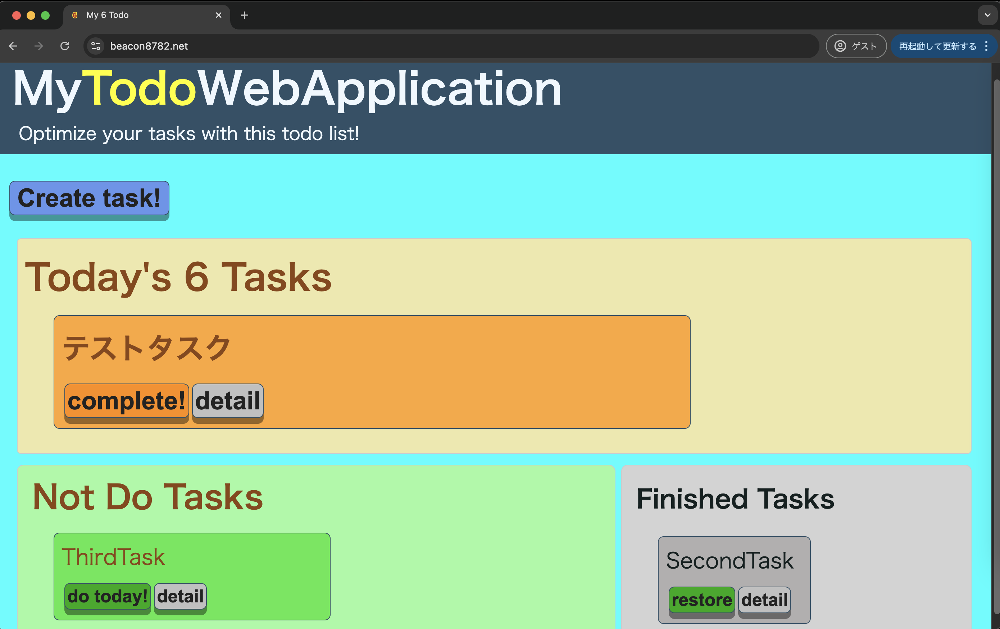

- タスク作成画面
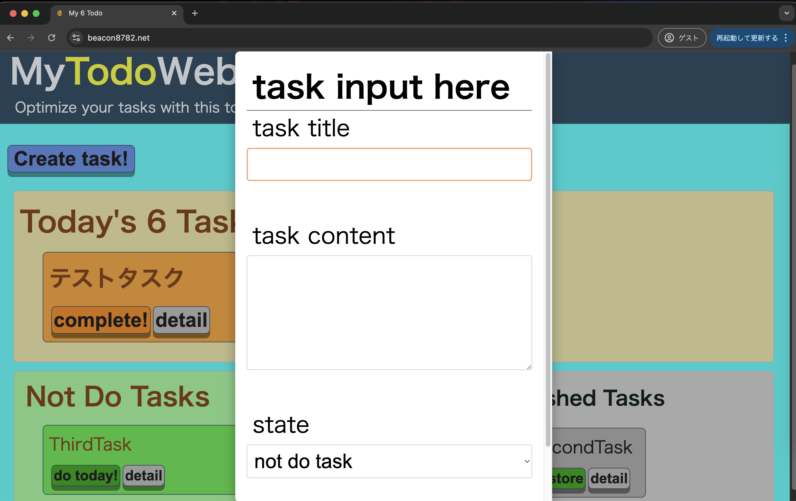
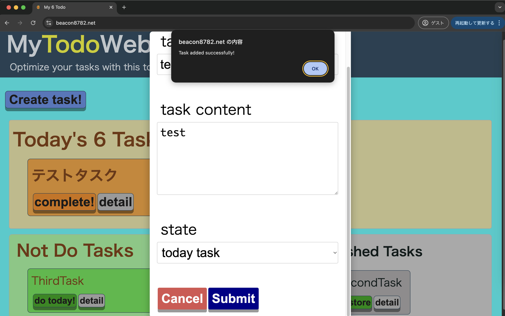
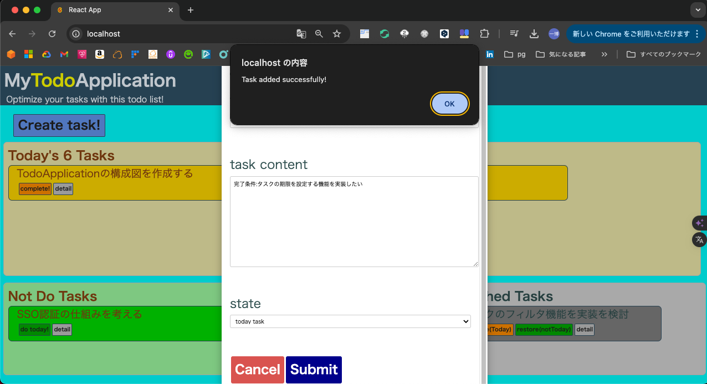

- タスク詳細画面
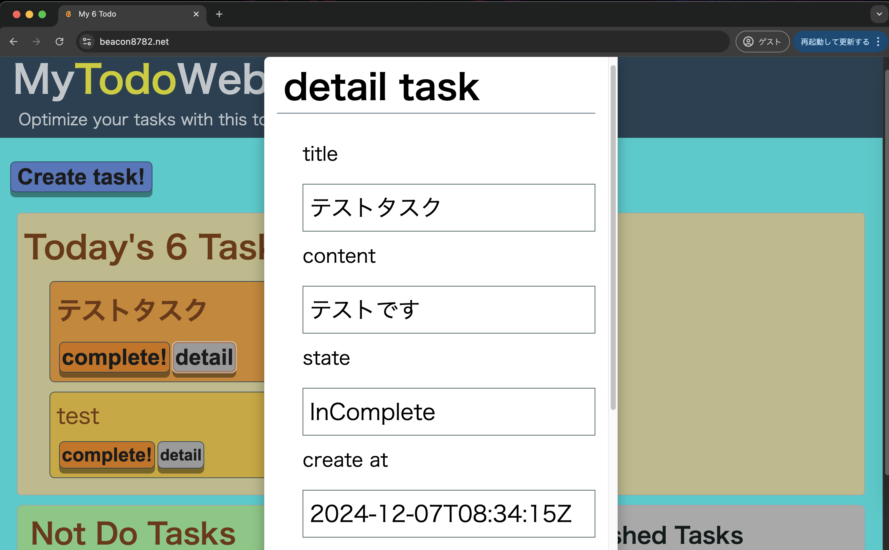

- タスク編集画面
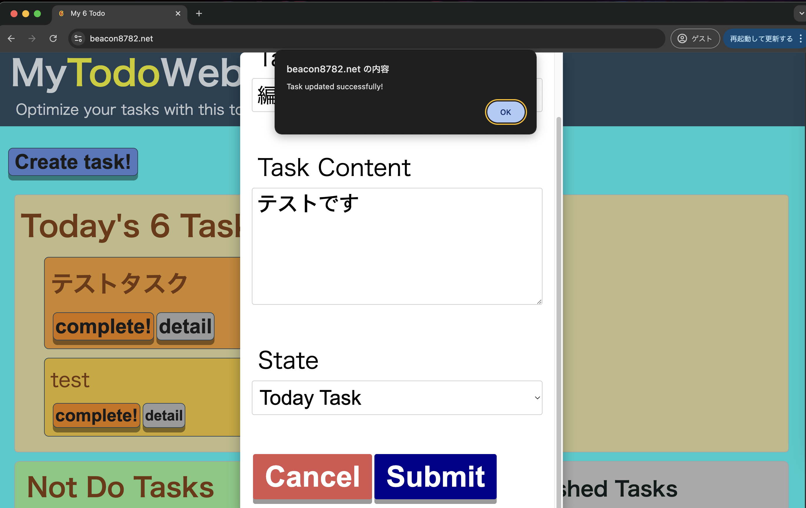
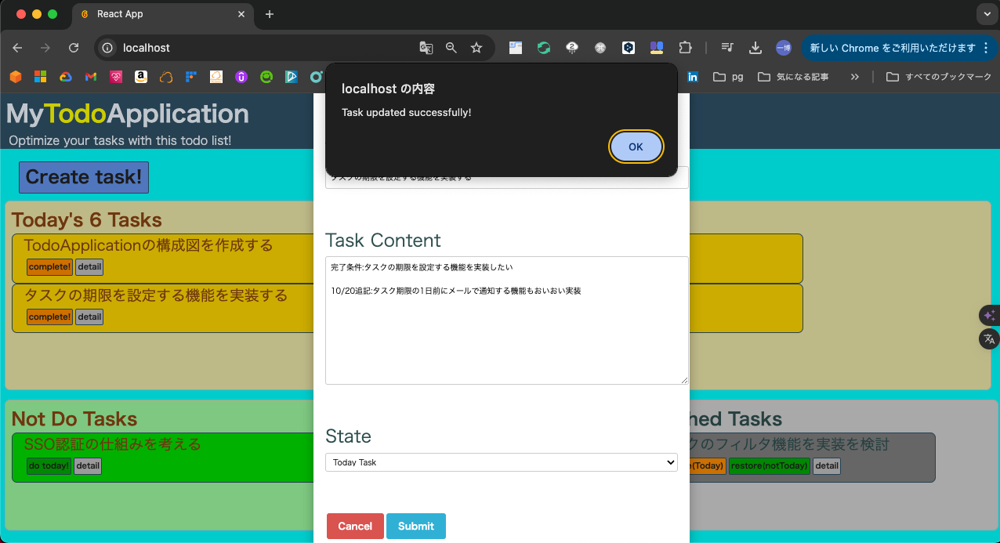

- タスク削除確認画面
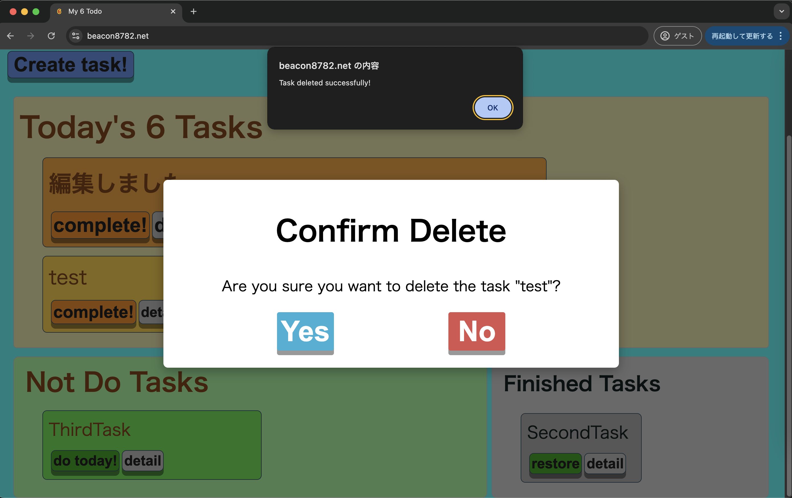
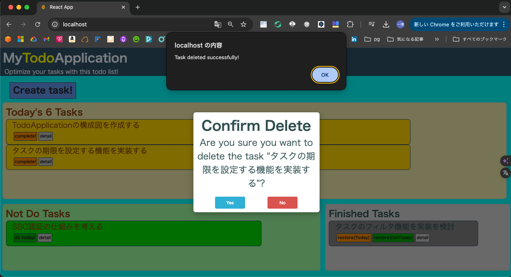
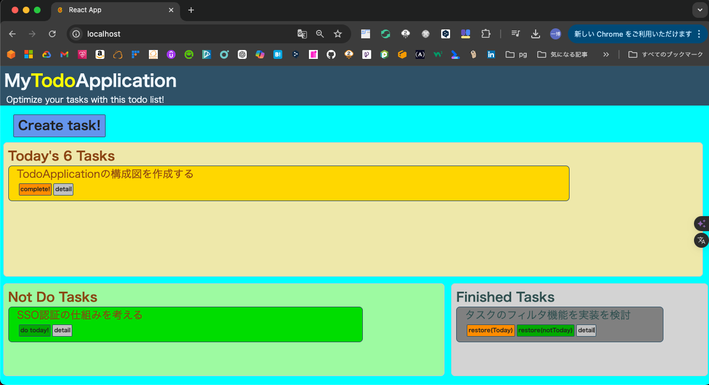

- アラート画面(6タスクへの追加上限)
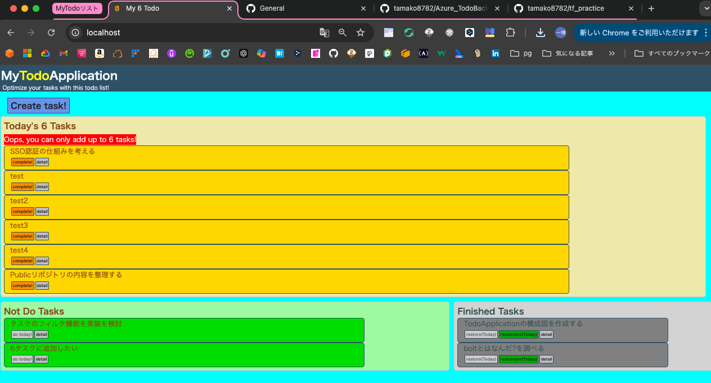

- 動作検証動画
[動作検証動画](./diagram/movie/demoplay.mov)


## 3. アーキテクチャ概要

### 3.1 全体構成図
  - 全体アーキテクチャ構成図
※作成中
    
  - クラスター構成図


### 3.2 主要コンポーネント一覧
- **Webサーバ**: Nginx 1.27.2
- **バックエンド**: Go 1.23
- **フロントエンド**: React 18.3.1
- **データベース**: MySQL 8.2.0
- **マイグレーションツール**: migrate/migrate 4.11.0
- **コンテナ**: Docker 24.0.7
- **コンテナオーケストレーション(開発環境)**: Docker Compose 2.23.3
- **コンテナオーケストレーション(クラスター)**: Kubernetes cluster 1.30.0
- **コンテナオーケストレーション(クライアント)**: Kubernetes Kubectl 1.30.2
- **コンテナオーケストレーション(kubernetesマニフェスト管理)**: kustomize 5.4.3
- **コンテナオーケストレーション(パッケージ管理)**: Helm 3.16.3
- **クラウドプロバイダー**: AWS
- **IaC**: Terraform 1.9.8

## 4. コンポーネントごとの概要

### 4.1 webサーバー層 
- **概要**: Nginxを使用して、APIリクエストを各マイクロサービスにルーティング。
- **設定**:
  - **リバースプロキシ**: 各サービスへのリクエストを適切にルーティング
    - `/api/`へのリクエストはバックエンドサービスにプロキシされる
    - 必要なヘッダー情報をバックエンドに転送
  - **静的ファイルの提供**: Reactの静的ファイルを`/usr/share/nginx/html`から提供し、`try_files`ディレクティブを使用してSPAのルーティングをサポート
  - **ロードバランシング**: 複数のバックエンドインスタンス間で負荷を分散（将来的に設定予定）
  - **SSL/TLS**: セキュアな通信を確保するためのSSL設定（将来的に設定予定）
  - **キャッシュ**: 静的コンテンツのキャッシュ設定（将来的に設定予定）


### 4.2 アプリケーション層

#### 4.2.1 フロントエンドWebアプリ
- **概要**: javascriptのフレームワークとしてReactを採用したフロントエンドコンポーネント
- **主要機能**:
  - **タスク管理**: タスクの登録、編集、削除、完了、未完了の状態管理
  - **タスク表示**: 当日実施予定タスクと実施しないタスクを一覧表示
  - **日付更新時にタスクリセット**: 日付が更新された時にタスクをリセットする
  - **フレームワーク**: Reactを使用
  - **状態管理**: 現在は`useState`を使用してアプリケーションの状態を管理、将来的にReduxに置き換える予定
  - **UIライブラリ**: Material-UIを使用してスタイリング(予定)
  - **ルーティング**: React Routerを使用してページ遷移を管理(予定)
  - **API通信**: Fetch APIを使用してバックエンドと通信

#### 4.2.2 バックエンドAPIアプリ
- **概要**: Goの標準ライブラリを使用して開発されたバックエンドサービス
- **主要機能**:
  - **タスク管理**: タスクの登録、編集、削除、完了、未完了の状態管理
  - **データベース接続**: go-sql-driver/mysqlを使用してデータベースとの通信
  - **HTTPサーバー**: net/httpを使用してHTTPリクエストを受け付ける
  - **ルーティング**: gorilla/muxを使用してルーティングを管理
  - **APIエンドポイント**:
    - `GET /task`: タスクの一覧を取得
    - `POST /task/create`: 新しいタスクを作成
    - `GET /task/{id}`: 特定のタスクの詳細を取得
    - `PATCH /task/{id}/update`: タスクを更新
    - `DELETE /task/{id}/delete`: タスクを削除
    - `PATCH /task/{id}/change`: タスクの状態を変更
  - **エラーハンドリング**: カスタムミドルウェアを使用してエラーレスポンスを統一

### 4.2 データ層
#### 4.2.1 データベース
- **使用DB**: MySQL 8.0.2
- **デプロイメント**: AWS RDS 
- **データベース構造**: タスク管理用のテーブルを設計。
  - **テーブル名**: task
    - **カラム一覧**:
      - `task_id`: INT, プライマリキー, 自動インクリメント
      - `title`: VARCHAR(255), タスクのタイトル, 必須項目
      - `contents`: TEXT, タスクの詳細内容
      - `task_state`: ENUM('InComplete', 'Finished', 'NotDoTask'), タスクの状態, デフォルトは'NotDoTask'
      - `updated_at`: DATETIME, 更新日時, デフォルトはCURRENT_TIMESTAMP, 更新時に自動更新
      - `created_at`: DATETIME, 作成日時, デフォルトはCURRENT_TIMESTAMP
  - **インデックス**:
    - `PRIMARY KEY (task_id)`


### 4.3.1 アプリケーションコンテナプラットフォーム
- **概要**: コンテナオーケストレーションのためのプラットフォームとしてKubernetesを使用する
- **主要機能**:
  - **ローリングデプロイ**: Kubernetesを使用してアプリケーションをデプロイ
  - **スケーリング**: Kubernetesを使用してアプリケーションをスケーリング
  - **ロードバランシング**: Kubernetesを使用してアプリケーションをロードバランシング
  - **オートスケーリング**: Kubernetesを使用してアプリケーションをオートスケーリング
  - **ロギング**: Kubernetesを使用してアプリケーションのロギングを管理
  - **モニタリング**: Kubernetesを使用してアプリケーションのモニタリングを管理
- **環境分離**: 開発環境と本番環境を以下のソリューションによって分離する
  - **manifest管理**: kustomizeを使用して環境ごとのマニフェストの差分管理を行う
  - **コンテナイメージ管理**: ECRを使用してコンテナイメージの管理を行う
  - **開発環境(ローカル)**: kindサーバーまたはローカルのkubernetesクラスターを使用してコンテナオーケストレーションを行う
  - **ステージング環境**: kubernetes on EKSを使用してコンテナオーケストレーションを行う
  - **本番環境**: kubernetes on EKSを使用してコンテナオーケストレーションを行う
- **実装環境**:
  - **開発環境**: kindサーバーまたはローカルのkubernetesクラスター
  - **ステージング環境**: kubernetes on EKS
  - **本番環境**: kubernetes on EKS

### 4.4 インフラ層
#### 4.4.1 クラウドインフラ
- **クラウドプロバイダー**: AWS
- **主要サービス一覧**: 
  - AWS Elastic Kubernetes Service (EKS)
  - AWS RDS
  - AWS ECR
  - AWS ALB
  - AWS Route53
  - AWS ACM
  - AWS Secrets Manager
  - AWS S3
  - AWS dynamoDB
  - AWS VPC

#### 4.4.2 ネットワーク設計
- **VPC設計**: 
  - 1つのVPCを作成
  - 2つのAZにまたがる形で
    - パブリックサブネット2つ(外部からのアクセスを担うALB及び、NATgatewayの配置場所)
    - EKS用プライベートサブネット2つ(EKSNodeGroupの配置場所)
    - DB用プライベートサブネット2つ(RDSの配置場所)
    - NATgatewayを配置するパブリックサブネット1つ
      - 商用環境であればマルチAZ化をするのが好ましいが、今回はあくまで学習目的であり、冗長性以外に機能要件に差分はなく動作検証への影響はないためシングルAZで構築する
    - インターネットゲートウェイ向けのルート設定
    - サブネット間のルート設定

### 4.4.3 ロギングとモニタリング
- **設定**: Cloudwatch及びKubernetesのPrometheus、datadog(無料試用版)をそれぞれ
  適用しオブザーバビリティや精密なロギング等コストや運用保守観点のオペレーションのしやすさを評価する(予定)

### 3.3.4 IaC

- **設定**: Terraformを使用してインフラストラクチャの管理を自動化する
- **実装方針**: 
  - 環境変数や秘密情報の管理にはvariableブロックを用いて
  あらかじめ作成済みの環境変数登録スクリプトを用いてローカル及びgithubactionsへの環境変数登録を実施する。
  - tfstateファイルの管理にはS3バケットを用いたリモートバックエンドでのtfstateファイルの管理を実施する。
  - tfstateの競合を防ぐためにbackendブロックを用いたロックメカニズムをaws dynamodbを用いて実施する。
  - ディレクトリ構造は以下の通りとする

```
.
├── infra-cfn-dns
│   ├── dns.tf
│   ├── main.tf
│   ├── output.tf
│   └── variables.tf
├── infra-rds-eks
│   ├── alb-ingress-policy.json
│   ├── database.tf
│   ├── ecr.tf
│   ├── eks.tf
│   ├── iam.tf
│   ├── main.tf
│   ├── natgw.tf
│   ├── network.tf
│   ├── output.tf
│   ├── secrets.tf
│   ├── tamakoapp.json
│   └── variables.tf
├── tfstate_manage
│   ├── main.tf
│   ├── output.tf
│   ├── resource.tf
│   └── variables.tf
└── vars_and_secrets
    ├── ghcli_regist_sec.sh
    ├── ghcli_regist_var.sh
    ├── local_regist_sec.sh
    ├── local_regist_var.sh
    ├── secrets.yml
    └── var.yml
```

  - ディレクトリ用途説明
    - `infra-cfn-dns`: ドメイン名を管理するためのroute53及びACMの設定を行うディレクトリ
    - `infra-rds-eks`: 主要部分であるRDSとEKSの設定を行うディレクトリ
    - `tfstate_manage`: tfstateファイルの管理を行うリソースの管理を行うディレクトリ
    - `vars_and_secrets`: 環境変数や秘密情報の管理を行うスクリプトを配置するディレクトリ

## 4. セキュリティ設計

### 4.1 認証・認可
- **概要**: OAuth 2.0を使用したユーザ認証の実装（将来的に検討）。

### 4.2 データ保護
- **データ暗号化**: 暗号化に関する設定は未定。

## 5. デプロイメントガイド

### 5.1 開発環境セットアップ
- **必要ツール**: Docker、Docker Compose、kubectlを使用。
- **開発環境**:
  - **MyPC**: 
    - OS: 14.6.1（23G93）
    - アーキテクチャ: ARM64
    - カーネルバージョン: Darwin Kernel Version 23.6.0
  - **Docker Desktop**: 
    - バージョン: 4.26.1
  - **Kind**: 
    - バージョン: kind 0.23.0

### 5.2 本番環境デプロイ
- **CI/CDパイプライン**: GitHub Actionsによる自動化デプロイを設定予定。

## 6. テスト計画

### 6.1 ユニットテスト
- **概要**: GoおよびReactのコンポーネント対するユニットテスト、 Kubernetesの構文チェックが含まれています。

### 6.2 インテグレーションテスト
- **概要**: APIを含む各サービス間のテストを予定。


