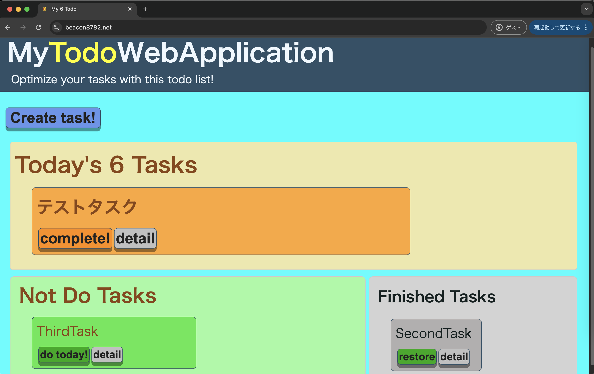
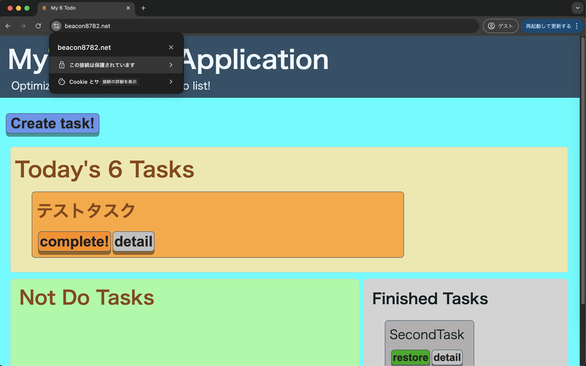
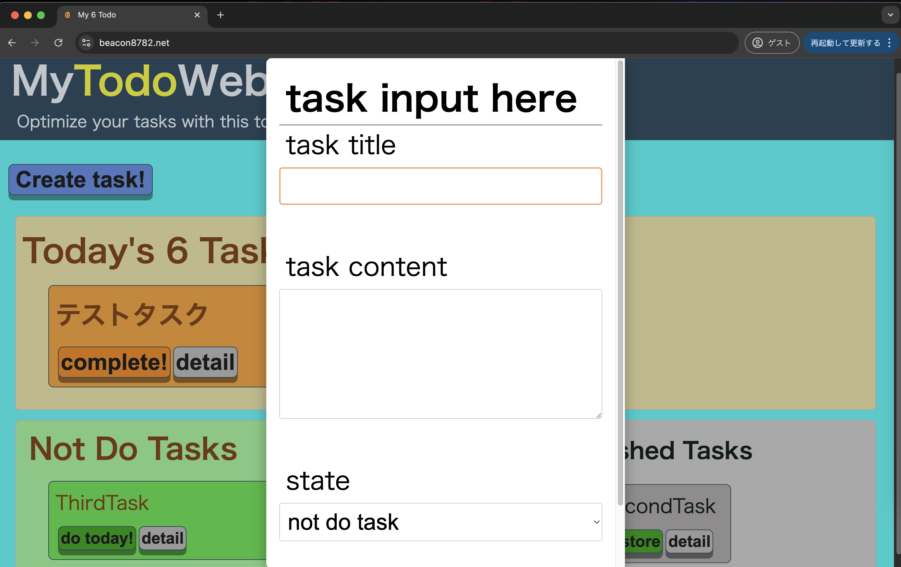
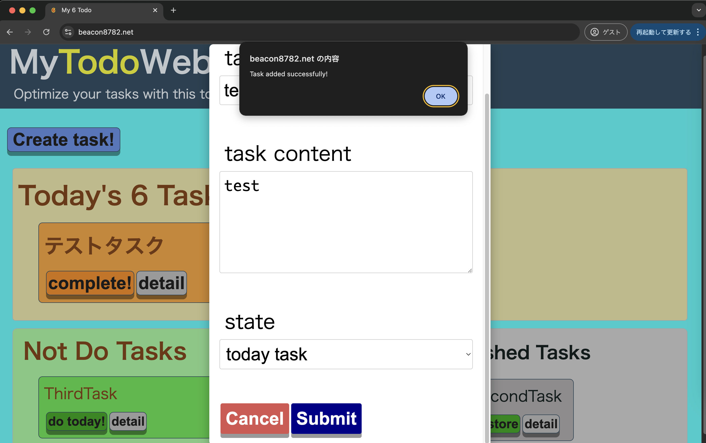
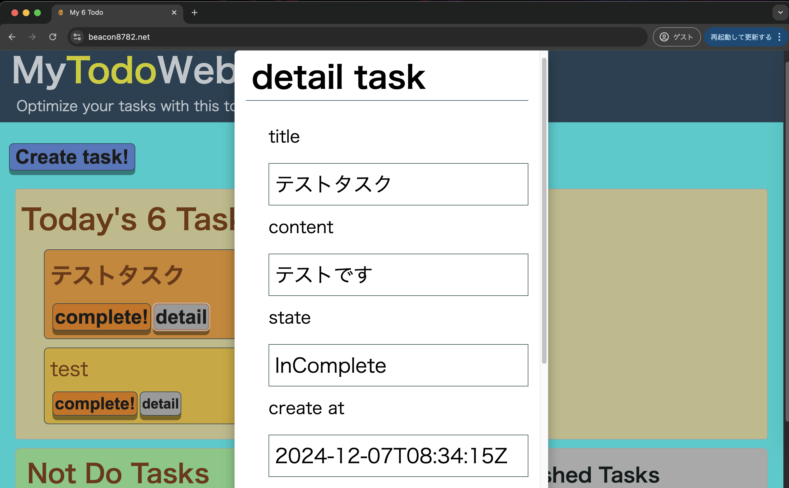
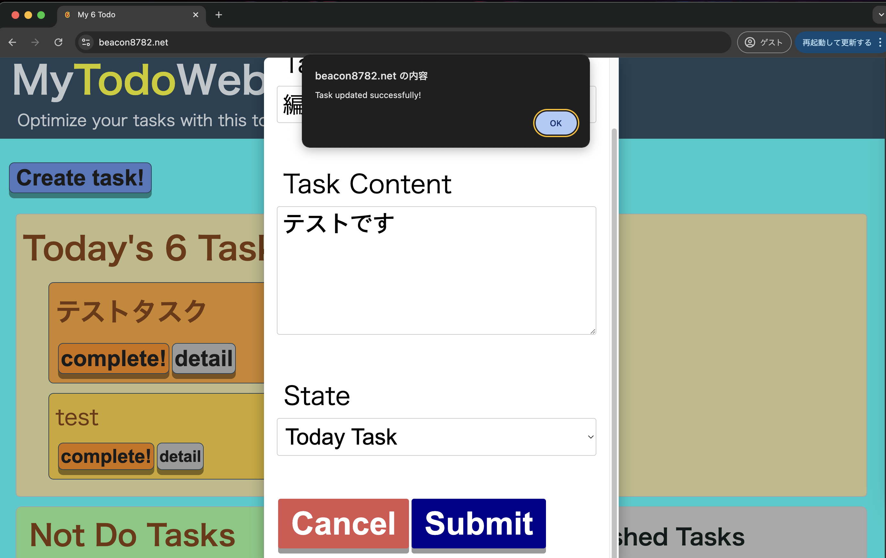
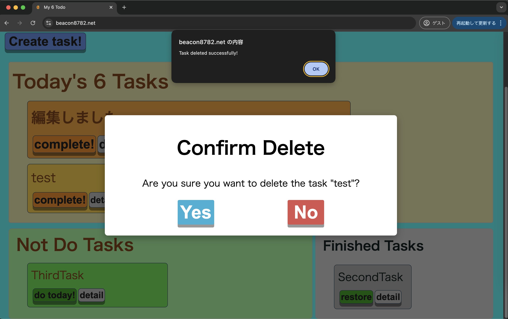
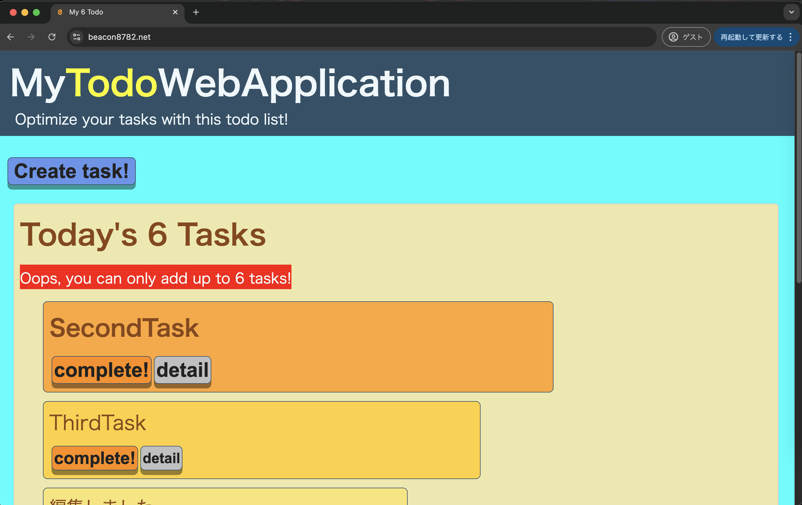
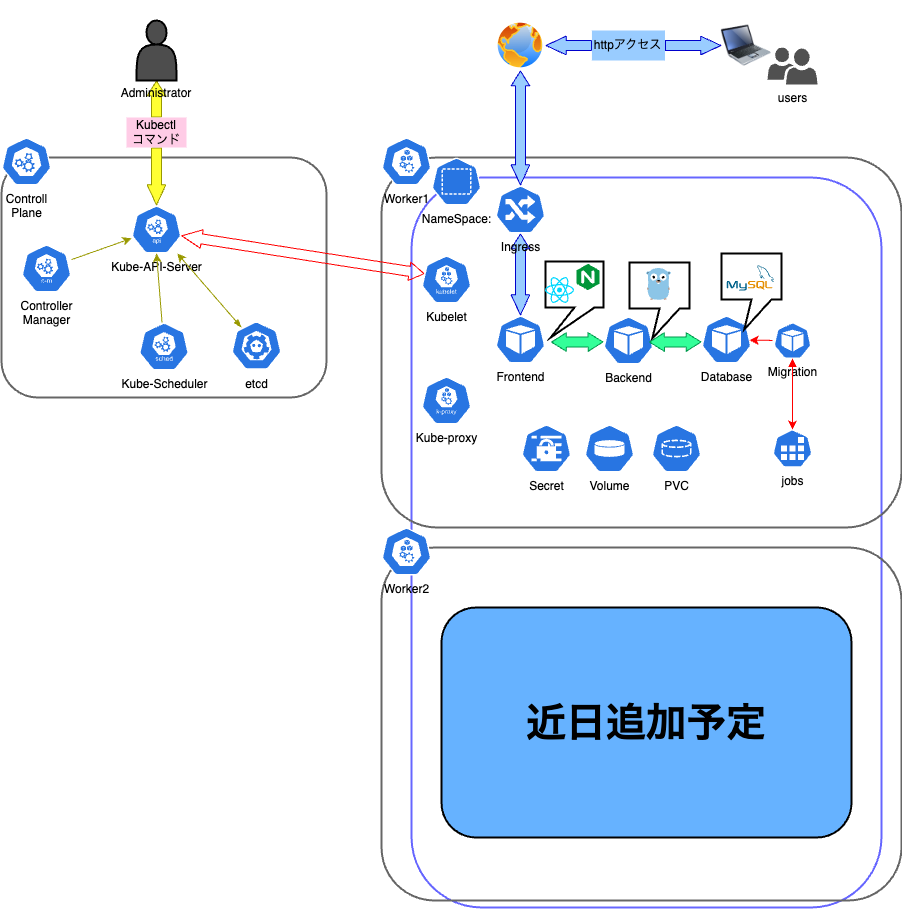

# MyTodoWebApplication_on_AWS 作成プロジェクトについて@v0.0.1

## 0. メタ情報
### 0.1 作成者
- 作成者: tamako8782
- 共同作成者: -
- github: https://github.com/tamako8782
- x: https://x.com/tamako8782

### 0.2 改定履歴

| # | 版数   | 改定内容                       | 改定者   | 改定日       |
|----------|-----------|--------------------------------|----------|--------------|
| 1        | v0.0.1    | 初版作成                       | tamako8782 | 2024-12-07   |
| 2        |     |        |  |    |
| 3        |     |        |  |    |
| 4        |     |        |  |    |
| 5        |     |        |  |    |


## 1. プロジェクトの取組み方について
### 1.1 プロジェクトの目的
当プロジェクトは独自のTodアプリをインフラ、コンテナ、データベース、バックエンド、フロントエンドの各コンポーネントの理解を深め、ある企業の新規開発案件を想定して取り組む。<br>
<br>
それを踏まえ、学習における目的、及び商品として(革新的なTodoアプリケーションを開発しTodoアプリの歴史を塗り替えることを目論む)の目的と2つの観点の目的を制定した。
<br>
<br>
これを、以下の通り定義する。

### 1.1.1 学習目的
  - システム全体の複合的な理解
  データベース実装、バックエンドAPIサーバーの構築、フロントエンドサーバーにて実際にユーザーがどういったUIに触れるのかまでをいわゆるフルスタック的に実装、また基盤として動くコンテナオーケストレーションツールと更に土台のクラウドインフラ部分とそれをコード化する過程で、より実務での新規構築に近い内容を自身のアイデアやこれまでの学習内容を駆使し応用し、まんべんなく実践的に使えるスキルを習得することを目的とする<br>

### 1.1.1.1 目的策定の背景について
  よくある各コンポーネントを技術習得するための手段としては書籍やUdemy、qiita等サイトに掲載された情報からハンズオンでベーシックアプリケーションの構築、ビルドデプロイ手法の検討、環境構築を実施するものが巷に溢れている。<br>
<br>
  当初はそれらを何度も反復し技術習得に勤しんでいた。
  これらは、機能としての役割や仕組みを理論上は理解でき、資格の勉強や
  そのハンズオンを反復することにおいては、確かに効力を感じていた。
  <br>
  <br>
  しかし、その習得した技術がサービスとして構成されたときにどのように役立ちどう重要であり、なぜその技術を選択したのか?などの疑問が現場ではいつもつきまとい、
  <br>
  <br>
  ｢実際に試してみたけど現場で活きない!すぐ忘れる!｣
  <br>
  <br>
  ことがよくあり技術として定着していない焦燥感を感じて辟易していた。<br>
  
### 1.1.1.2 背景に対しての方針設定
  そんな不満を打破し実務でも活きる知識と技術を習得するために<br>
  当プロジェクトは以下の方針で取り組むこととした。<br>
  ① 自分が携わるコンポーネントの役割を理解しながら、全てを自分で実装する。<br>
  - 自分が作成した独自ドメインでSSL/TLSを終端処理する機構を作成しHTTPS通信で利用
  - WebサーバーによるWebページのルーティングやリバースプロキシを実施
  - フロントエンド開発言語によるSPAアプリのUIと機能の構築
  - バックエンド開発言語によるAPIリクエストとレスポンスとデータベースコネクション
  - バックエンドから受け取ったクエリでマネージドデータベースの操作
  - それらの実行基盤をコンテナオーケストレーションを使って構築
  - そのコンテナ基盤はクラウドサービスにIacを用いて作成する<br>
  
  そんな昨今のモダンアーキテクチャにて採用される機能を結集したものを完成形とし、<br>
  <br>
  いわゆる"フルスタック的"にアーキテクチャ全体を見通し各コンポーネントが持つ役割を理解しながら進める。<br>
  <br>
  ② 自身の｢こういうTodo管理手法がめちゃくちゃ効果的だった｣という実体験をもとにCRUD操作のチュートリアルのようなWebアプリケーションではなく、機能に意味や目的を持たせたうえで作成する。<br>
  <br>
  - 人間の行動心理学の観点からTodoアプリケーションの良し悪しを調査し、タスクパフォーマンスの観点から効果的と言えるTodoを考案
  - 考案したTodoをアプリケーションとした場合に最もベストな実装方法を検討し、そのアーキテクチャを実現するための技術選定を実施
  - 実際に自分が使いたいと思えるようなTodo管理アプリケーションを開発することを目指す。 
  
  踏まえ<br>
  企画立案、要件定義、基本設計、詳細設計、実装、テスト、デプロイ、運用保守の各工程をすべて自分で実施することで全体を通して一貫したアプリを作成し、各コンポーネントの連なりや前後関係を理解しながら実装を行う。

### 1.1.2 商品目的
 あるweb制作会社が、従来のTodo管理ツールをよりシンプルかつより人間の思考に合理的なTodoアプリケーションを思いついたのでそれを開発しリリースを目論み、利用者の高いパフォーマンスに寄与することを目的とした。

### 1.1.2.1 筋書き1_あるweb制作会社の社長が感じた違和感
今日も自身の仕事が終わらなかった<br>
<br>
そんな、不満を垂れながら、あるweb制作会社の社長は、自前のTodo管理ツールを眺めていた。<br>
<br>
最初は勇んでTodoをアウトプットし、一時思考が整理されたのも束の間、気づけば未消化のタスクであふれかえる。
<br><br>
タスクを追加するのはいいが前に作成したタスクに気持ちが向かず、優先順位も不明瞭なまま、なんとなくこなしていくも、積もり積もるタスクはどんどん増えるばかり
<br><br>
しまいには、そのTodo管理ツールは使わなくなり、マルチタスクは非効率的!とわかっていても、思考は今あることに手一杯になって気づけば遅い時間まで残業を繰り返す。
<br><br>
そうやって、いろいろなTodoアプリを自分で作ったり乗り換えたり、する中で、次のTodoアプリの試運転に手応えが感じられなくなっていた今日このごろだった。
<br><br>

### 1.1.2.2 筋書き2_社長のひらめき 
  そんな中、社長があるニュースサイトを閲覧していたときに、ある記事が飛び込んできた
  <br><br>
  それは、人間の[決断疲れ](https://ja.wikipedia.org/wiki/%E6%B1%BA%E6%96%AD%E7%96%B2%E3%82%8C)に関するものだった。
  <br><br>
  人間が意思決定を何度も繰り返すと、意思決定の質が低下することを示した心理学的な現象のことについてカジュアルに書かれた記事だったが、社長は自身のTodo管理に関しても同じことが起きているのではないかと考えた。
  <br><br>
  ｢たくさんの機能やオプション、優先度別に分けられたたくさんのTodoを見る必要はない。もっとシンプルであるべきだ!｣と
  <br><br>
  そんな経緯で、昨今のTodo管理ツールに対して、課題を洗い出し、自身のアイデアとそれを解決するための革新的なTodoアプリケーションを開発することを考え社内のエンジニアと企画立案会議を行い、そのアイデアを形にしていくべく熱の冷めやまぬうちにとリリースを会社の人間を巻き込んで目指したのだった。
  <br><br>
  

### 1.2 プロジェクトの取り組みスタンス
1. 完璧を求めないこと<br>
   初めてプログラミングもするし、webサイトもするしと初めてづくしである以上、完璧なものは作れない。<br>
   そのため、むしろ荒削りであっても、最低限のセキュリティや秘密情報の扱いを適切に行いつつ、機能を最低限にやりたかったことを目指すようにすること。
  <br><br>
1. 指摘を恐れない<br>
   作成物に対する指摘を恐れず、受け入れ、それをもとにさらなる改良を加えることを目指す。  <br>
   むしろ指摘をありがたいと思う。<br><br>
2. 誰かに良い影響を与えることを念頭にやる<br>
   自身のエンジニアとしての成長だけでなく、<br>
   この取り組みが、世界の何処かの喜びとなるようにアウトプットを見据えて実施する。<br>
   どんなに変な実装でも、その作成物が成長していく姿に勇気づけられる人。または、実装の仕方が参考にしていただける人がいるかも知れない。<br>
   そんな風に誰かの役にたち喜びを生んでいけるようなスタンスを目指す。<br>
  

## 2. 作成したいアプリケーションについて

### 2.1 Todoアプリケーションの特徴
### 2.1.1 Todoアプリの概要説明

本プロジェクトで作成する、Todoアプリケーションは**アイビーリーメソッド**というタスク管理手法を実現するアプリケーションである。<br>
<br>
端的に言えば、以下のルールを定めたTodoリストである。
<br>
1. 今日やるべきタスクは6つまで登録できるが、それ以上は登録できない。<br>
2. 6つあるうちの1つ目から順に消化するがそれが終わるまで2つ目のタスクとそれ以外のタスク(微細なタスクは除く)は実施できない。<br>
3. 1日の完了時点で6つのタスクが終わろうと終わるまいとすべてリセットされ、<br>また翌日に6つのタスクを登録し1.のルールに戻る<br>
<br>

 これは、20世紀前半、アメリカ最大の鉄銅会社であったベツレヘム・スチール・コーポレーションの社長チャールズ・M・シュワブ氏が、会社の経営の効率化のために、コンサルタントのアイビー・リー氏を雇った。<br>そこで、リー氏が考案したメソッドが、アイビー・リー・メソッドである。

シュワブ氏は、このメソッドにたいし<br>
｢これまで受け入れたアドバイスの中で最も有益だった｣と言い、<br>
リーに対し、25,000ドル（現在の価値でおよそ4400万円）をリーに支払った
<br>
<br>
といった逸話があったりする。
<br><br>
これは決定疲れを解消することができるという心理学的な現象を利用したものでもあり、昨今のSNSやメディアのように情報が溢れかえる中であるからこそ、<br>
人間の意思決定という限りあるリソースを有効活用し、生産性向上につながることが期待できる。
<br><br>

- 参考: [wikipedia_決定疲れについて](https://ja.wikipedia.org/wiki/%E6%B1%BA%E6%96%AD%E7%96%B2%E3%82%8C)
- 参考: [wikipedia_アイビー・リーについて](https://ja.wikipedia.org/wiki/%E3%82%A2%E3%82%A4%E3%83%93%E3%83%BC%E3%83%BB%E3%83%AA%E3%83%BC)

### 2.1.2 主要機能
踏まえアプリケーションをの主要機能は以下の通りとする。<br>
<br>
1. webブラウザからアクセスできる。
2. 項目としては[今日やるべきタスク][今日はやらないタスク][完了済みタスク]とタスク作成ボタンがある。
3. タスク作成時にはタスクタイトルとタスク詳細を記載でき、それぞれ任意の文字数を入力できる。また、[今日やるべきタスク]に登録するか、[今日はやらないタスク]に登録するかを選択できる。
4. [今日やるべきタスク]には6つのタスクを追加する枠があり、それ以上は登録できない。
5. [今日やるべきタスク]は完了する操作([完了済みタスク]に移動)と、タスクの編集、削除ができる。
6. [今日はやらないタスク]はいくつでも登録可能であるが、完了をする操作はできず、[今日やるべきタスク]に戻す操作か、タスクの編集、削除ができる。
7. [完了済みタスク]はタスクの編集、削除ができる。


### 2.1.3 ゆくゆく実装したい機能
1. 指定した時間でやるべきタスクの内容は今やるべきでないタスクに戻される
2. ユーザー認証
3. 今やるべきでないタスクは優先度やジャンル別で更に細分化
4. タスク完了時にファンファーレてきな派手な演出
5. 完了済みタスクの着手時間の統計値をグラフ化
6. タスクのタグ(自由記入、主にタスクカテゴリ等記載を想定)機能の導入
7. タスクに対してのコメント機能の追加
8. タスクのフィルタ、ソート機能を導入
9. タスクをcsvでエクスポートする方法を導入
10. ドラッグアンドドロップでタスクの並び替えが可能
11. タスクの期限の追加
12. マルチユーザー対応
13. 生成AIからタスク遂行のための細分化やマイルストーンのアドバイスをくれる機能

### 2.1.4 アプリケーション画面サンプル

- メイン画面


- 証明書の確認


- タスク作成


- タスク詳細画面


- タスク編集画面


- タスク削除確認画面


- アラート画面(6タスクへの追加上限)


- 動作検証動画

https://github.com/user-attachments/assets/b3c6c823-2192-4004-96e2-460e05f6ac97


## 3. アーキテクチャ概要

### 3.1 全体構成図
  - 全体アーキテクチャ構成図

    
  - クラスター構成図(ローカルのkindで動かす場合)




### 3.2 主要コンポーネント一覧
- **Webサーバ**: Nginx 1.27.2
- **バックエンド**: Go 1.23
- **フロントエンド**: React 18.3.1
- **データベース**: MySQL 8.0.2
- **マイグレーションツール**: migrate/migrate 4.11.0
- **コンテナ**: Docker 24.0.7
- **コンテナオーケストレーション(開発環境)**: Docker Compose 2.23.3
- **コンテナオーケストレーション(クラスター)**: Kubernetes cluster 1.30.0
- **コンテナオーケストレーション(クライアント)**: Kubernetes Kubectl 1.30.2
- **コンテナオーケストレーション(kubernetesマニフェスト管理)**: kustomize 5.4.3
- **コンテナオーケストレーション(パッケージ管理)**: Helm 3.16.3
- **クラウドプロバイダー**: AWS
- **IaC**: Terraform 1.9.8

## 4. コンポーネントごとの概要

### 4.1 webサーバー層 
- **概要**: Nginxを使用して、APIリクエストを各マイクロサービスにルーティング。
- **設定**:
  - **リバースプロキシ**: 各サービスへのリクエストを適切にルーティング
    - `/api/`へのリクエストはバックエンドサービスにプロキシされる
    - 必要なヘッダー情報をバックエンドに転送
  - **静的ファイルの提供**: Reactの静的ファイルを`/usr/share/nginx/html`から提供し、`try_files`ディレクティブを使用してSPAのルーティングをサポート
  - **ロードバランシング**: 複数のバックエンドインスタンス間で負荷を分散（将来的に設定予定）
  - **SSL/TLS**: セキュアな通信を確保するためのSSL設定（将来的に設定予定）
  - **キャッシュ**: 静的コンテンツのキャッシュ設定（将来的に設定予定）


### 4.2 アプリケーション層

#### 4.2.1 フロントエンドWebアプリ
- **概要**: javascriptのフレームワークとしてReactを採用したフロントエンドコンポーネント
- **主要機能**:
  - **タスク管理**: タスクの登録、編集、削除、完了、未完了の状態管理
  - **タスク表示**: 当日実施予定タスクと実施しないタスクを一覧表示
  - **日付更新時にタスクリセット**: 日付が更新された時にタスクをリセットする
  - **フレームワーク**: Reactを使用
  - **状態管理**: 現在は`useState`を使用してアプリケーションの状態を管理、将来的にReduxに置き換える予定
  - **UIライブラリ**: Material-UIを使用してスタイリング(予定)
  - **ルーティング**: React Routerを使用してページ遷移を管理(予定)
  - **API通信**: Fetch APIを使用してバックエンドと通信

#### 4.2.2 バックエンドAPIアプリ
- **概要**: Goの標準ライブラリを使用して開発されたバックエンドサービス
- **主要機能**:
  - **タスク管理**: タスクの登録、編集、削除、完了、未完了の状態管理
  - **データベース接続**: go-sql-driver/mysqlを使用してデータベースとの通信
  - **HTTPサーバー**: net/httpを使用してHTTPリクエストを受け付ける
  - **ルーティング**: gorilla/muxを使用してルーティングを管理
  - **APIエンドポイント**:
    - `GET /task`: タスクの一覧を取得
    - `POST /task/create`: 新しいタスクを作成
    - `GET /task/{id}`: 特定のタスクの詳細を取得
    - `PATCH /task/{id}/update`: タスクを更新
    - `DELETE /task/{id}/delete`: タスクを削除
    - `PATCH /task/{id}/change`: タスクの状態を変更
  - **エラーハンドリング**: カスタムミドルウェアを使用してエラーレスポンスを統一

### 4.3 データ層
#### 4.3.1 データベース
- **使用DB**: MySQL 8.0.2
- **デプロイメント**: AWS RDS 
- **データベース構造**: タスク管理用のテーブルを設計。
  - **テーブル名**: task
    - **カラム一覧**:
      - `task_id`: INT, プライマリキー, 自動インクリメント
      - `title`: VARCHAR(255), タスクのタイトル, 必須項目
      - `contents`: TEXT, タスクの詳細内容
      - `task_state`: ENUM('InComplete', 'Finished', 'NotDoTask'), タスクの状態, デフォルトは'NotDoTask'
      - `updated_at`: DATETIME, 更新日時, デフォルトはCURRENT_TIMESTAMP, 更新時に自動更新
      - `created_at`: DATETIME, 作成日時, デフォルトはCURRENT_TIMESTAMP
  - **インデックス**:
    - `PRIMARY KEY (task_id)`


### 4.4.1 アプリケーションコンテナプラットフォーム
- **概要**: コンテナオーケストレーションのためのプラットフォームとしてKubernetesを使用する
- **主要機能**:
  - **ローリングデプロイ**: Kubernetesを使用してアプリケーションをデプロイ
  - **スケーリング**: Kubernetesを使用してアプリケーションをスケーリング
  - **ロードバランシング**: Kubernetesを使用してアプリケーションをロードバランシング
  - **オートスケーリング**: Kubernetesを使用してアプリケーションをオートスケーリング
  - **ロギング**: Kubernetesを使用してアプリケーションのロギングを管理
  - **モニタリング**: Kubernetesを使用してアプリケーションのモニタリングを管理
- **環境分離**: 開発環境と本番環境を以下のソリューションによって分離する
  - **manifest管理**: kustomizeを使用して環境ごとのマニフェストの差分管理を行う
  - **コンテナイメージ管理**: ECRを使用してコンテナイメージの管理を行う
  - **開発環境(ローカル)**: kindサーバーまたはローカルのkubernetesクラスターを使用してコンテナオーケストレーションを行う
  - **ステージング環境**: kubernetes on EKSを使用してコンテナオーケストレーションを行う
  - **本番環境**: kubernetes on EKSを使用してコンテナオーケストレーションを行う
- **実装環境**:
  - **開発環境**: kindサーバーまたはローカルのkubernetesクラスター
  - **ステージング環境**: kubernetes on EKS
  - **本番環境**: kubernetes on EKS

### 4.5 インフラ層
#### 4.5.1 クラウドインフラ
- **クラウドプロバイダー**: AWS
- **主要サービス一覧**: 
  - AWS Elastic Kubernetes Service (EKS)
  - AWS RDS
  - AWS ECR
  - AWS ALB
  - AWS Route53
  - AWS ACM
  - AWS Secrets Manager
  - AWS S3
  - AWS dynamoDB
  - AWS VPC

#### 4.5.2 ネットワーク設計
- **VPC設計**: 
  - 1つのVPCを作成
  - 2つのAZにまたがる形で
    - パブリックサブネット2つ(外部からのアクセスを担うALB及び、NATgatewayの配置場所)
    - EKS用プライベートサブネット2つ(EKSNodeGroupの配置場所)
    - DB用プライベートサブネット2つ(RDSの配置場所)
    - NATgatewayを配置するパブリックサブネット1つ
      - 商用環境であればマルチAZ化をするのが好ましいが、今回はあくまで学習目的であり、冗長性以外に機能要件に差分はなく動作検証への影響はないためシングルAZで構築する
    - インターネットゲートウェイ向けのルート設定
    - サブネット間のルート設定

### 4.4.3 ロギングとモニタリング
- **設定**: Cloudwatch及びKubernetesのPrometheus、datadog(無料試用版)をそれぞれ
  適用しオブザーバビリティや精密なロギング等コストや運用保守観点のオペレーションのしやすさを評価する(予定)

### 4.5.4 IaC

- **設定**: Terraformを使用してインフラストラクチャの管理を自動化する
- **実装方針**: 
  - 環境変数や秘密情報の管理にはvariableブロックを用いて
  あらかじめ作成済みの環境変数登録スクリプトを用いてローカル及びgithubactionsへの環境変数登録を実施する。
  - tfstateファイルの管理にはS3バケットを用いたリモートバックエンドでのtfstateファイルの管理を実施する。
  - tfstateの競合を防ぐためにbackendブロックを用いたロックメカニズムをaws dynamodbを用いて実施する。
  - ディレクトリ構造は以下の通りとする

```
.
├── infra-cfn-dns
│   ├── dns.tf
│   ├── main.tf
│   ├── output.tf
│   └── variables.tf
├── infra-rds-eks
│   ├── alb-ingress-policy.json
│   ├── database.tf
│   ├── ecr.tf
│   ├── eks.tf
│   ├── iam.tf
│   ├── main.tf
│   ├── natgw.tf
│   ├── network.tf
│   ├── output.tf
│   ├── secrets.tf
│   ├── tamakoapp.json
│   └── variables.tf
├── tfstate_manage
│   ├── main.tf
│   ├── output.tf
│   ├── resource.tf
│   └── variables.tf
└── vars_and_secrets
    ├── ghcli_regist_sec.sh
    ├── ghcli_regist_var.sh
    ├── local_regist_sec.sh
    ├── local_regist_var.sh
    ├── secrets.yml
    └── var.yml
```

  - ディレクトリ用途説明
    - `infra-cfn-dns`: ドメイン名を管理するためのroute53及びACMの設定を行うディレクトリ
    - `infra-rds-eks`: 主要部分であるRDSとEKSの設定を行うディレクトリ
    - `tfstate_manage`: tfstateファイルの管理を行うリソースの管理を行うディレクトリ
    - `vars_and_secrets`: 環境変数や秘密情報の管理を行うスクリプトを配置するディレクトリ

## 5. セキュリティ設計

### 5.1 認証・認可
- **概要**: OAuth 2.0を使用したユーザ認証の実装（将来的に検討）。

### 5.2 データ保護
- **データ暗号化**: 暗号化に関する設定は未定。

## 6. デプロイメントガイド

### 6.1 開発環境セットアップ
- **必要ツール**: Docker、Docker Compose、kubectlを使用。
- **開発環境**:
  - **MyPC(MacBookPro)**: 
    - OS: 14.6.1（23G93）
    - アーキテクチャ: ARM64
    - カーネルバージョン: Darwin Kernel Version 23.6.0
  - **Docker Desktop**: 
    - バージョン: 4.26.1
  - **Kind**: 
    - バージョン: kind 0.23.0

### 6.2 本番環境デプロイ
- **CI/CDパイプライン**: GitHub Actionsによる自動化デプロイを設定予定。

## 7. テスト計画

### 7.1 ユニットテスト
- **概要**: GoおよびReactのコンポーネント対するユニットテスト、 Kubernetesの構文チェックが含まれています。

### 7.2 インテグレーションテスト
- **概要**: APIを含む各サービス間のテストを予定。


