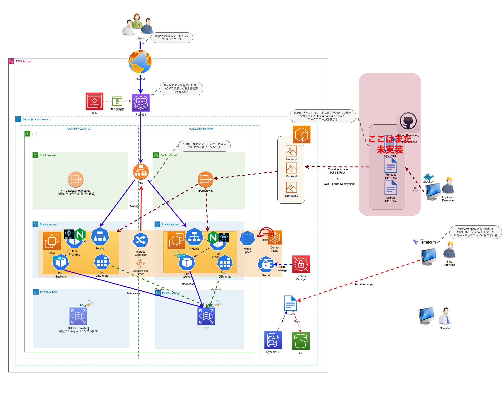

# React+GO+MysqlでSPAのTodoWebアプリを自作してAWS EKS上にデプロイしてTerrraformでIac化するとこまでやった一部始終_序章

## はじめに
はじめまして。

20代後半からIT業界に入り、3年半ほどNW(大体オンプレ)を中心にインフラエンジニアをしてるものです。<br><br>
たまにAWSやAzureのネットワーク絡みの構築とかはあるのですが、どうしてもサービス提供に付随したコアな構築部分は触れる機会がないなーと思い、<br><br>
そこらへんの知識を身につけるために、この度React+Go+MysqlでSPAのTodoWebアプリを自作してAWS EKS上にデプロイしてTerrraformでIac化するとこまでやろうと2024/6月から着手。<br><br>

気づけばフロントエンドもバックエンドもインフラも全部やる(いわゆるフルスタック?)的な感じに大体やってました。<br><br>

ただ、｢こんなすげーもん作ったぞ!｣というつもりは毛頭なく(むしろ｢この実装イケてなくね?｣というものもたくさんあると思います。)、とりあえず動くものは作れたので、<br><br>

その振り返りと、改善の記録をこれから記事にしていきたいと思います。<br><br>

## 注意書き
- この記事は、各種公式ドキュメントや参考記事から得た知見、と自身の仮説に基づいた検証結果を下に執筆してますが、内容の正確性や完全性を保証するものではありません。

- AWSを一部用いてますが、内容によっては無料枠に収まらず課金が発生するものもあります。<br>
  そのため、もし参考にして実施したい場合は、料金ダッシュボードをこまめに確認し、予期せぬ請求が発生しないよう注意してください。<br>
  想定外の請求が発生してしまっても、責任は負いかねますので、ご了承ください。

## 作ったもののご紹介

### 詳しくは以下のgithubのreadmeに書いてます。
https://github.com/tamako8782/MyTodoWebApplication_on_AWS

### なのでここではざっくりアプリの概要

せっかく作るなら、よくある入門本にあるようなTodoアプリだと<br>
つまらないので、ちょっとだけ凝ったものを作ることにしました。<br>
<br>
"アイビー・リーメソッド"といって6つのその日にやるべきタスクを書き出すしてそのタスク以外やらない!<br>
といった心理学でいうところの"決断疲れ"に対処することができる実用性高そうなTodoアプリを作ってます。<br>
<br>

参考①:[決断疲れ_wikipedia](https://ja.wikipedia.org/wiki/%E6%B1%BA%E6%96%AD%E7%96%B2%E3%82%8C)
参考②:[アイビー・リーメソッド_studyhacker](https://studyhacker.net/ivy-lee-method)

百聞は一見にしかず。以下のような感じのアプリです。<br>

https://github.com/user-attachments/assets/b3c6c823-2192-4004-96e2-460e05f6ac97

このアプリの特徴は以下のルールに則っていること。これにより決断疲れの消耗を抑えることを期待してます。<br>
1. 今日やるべきタスクは6つまで登録できるが、それ以上は登録できない。
2. 6つあるうちの1つ目から順に消化するがそれが終わるまで2つ目のタスクとそれ以外のタスク(微細なタスクは除く)は実施できない。
3. 1日の完了時点で6つのタスクが終わろうと終わるまいとすべてリセットされ、
また翌日に6つのタスクを登録し1.のルールに戻る

<br><br>
いわゆるSPA(Single Page Application)で作成してますから、一々HTMLページの遷移を生じることはなく、<br>
ページ遷移を伴うアプリと比べて表示が軽快であることもポイントかなと
<br><br>
基本的には画面でポチポチ表示したり、タスクを作成したり移動したりは
<br>Reactが操作に応じた指示をGoで作成したAPIサーバーにAPIリクエスト
<br>GoのAPIサーバーはその指示に従ってMysqlにデータを保存したり、データベースからデータを取得したりする。
<br>という感じです。
<br><br>

### 構成
全体構成は以下のようになってます。

  - 全体アーキテクチャ構成図


- 先ほどお話ししたReactなりGoなりのコードはAWS EKSクラスター内にて作成されたマネージドノード(EC2)上で動作しています。
- データベースはAWS RDS for MySQLを使用していてそこからデータを取得したり保存したりしています。
- 外部からのアクセスはRoute53による名前解決+ACMで発行された証明書でHTTPSアクセスを、ALB(EKSで作成したAWS Load Balancer ControllerのIngressリソースによって管理されてるやつ)に対して渡されて
  それが負荷分散されてEKSに対して通信が行われてます。
- EKS内で外部から受け取った通信はserviceで定義されたフロントエンドポッド(reactとnginx)に渡され
 そこではnginxがリバースプロキシとして動作していて、背後のバックエンドポッド(Go)に対して通信を行っています。
- バックエンドポッドはAPIサーバーとして受け取ったリクエスト通信を元に更に後ろのRDSに対して
  データの保存や取得を行います。
- データベースのマイグレーションはgolangのmigrateを使用しており、これもEKS上のjobポッドとして作成し、RDSの
  マイグレーションを行っています。
- データベース認証情報はAWS Secrets ManagerとKubernetesのSecretを連携させる実装(AWS Secrets Manager and Config Provider for Secret Store CSI Driver ...通称ASCP)を使用して
  そこからデータベース認証情報を取得しています。
- これらはterraformコードで大体管理しており、tfstateファイルはリモートバックエンド機能によりAWS S3に保存されています。


## この企画について

はじめにでもふれましたが、振り返りと改善の記録をこれから記事にしていきます。<br>
(せっかくなんでそういう企画だと思って取り組みます。)
<br>
方針としては、以下の2つの記録記事を不定期的に更新していく予定です。
<br>
```
① このアーキテクチャをどう工夫してこれまで作ってきたのかの記録(以降、**振返り記事**と呼称)
+ 
② このアーキテクチャを更に発展改善するリファクタリングの記録(以降、**改善記事**と呼称)
```

### この企画の想い
おそらく、この記事を読んでいただいている読者の中には、IT業界に参画を目指している人やIT業界に参画して今後更にレベルアップをしていきたい!ていう意欲のある方が多くいるのかなと思います。私も同じです<br><br>

ただ、ネット上には色々と有益なハンズオンだったりHowtoだったりが落ちてるとは思いますが、<br>
どうしても｢このハンズオンを習得した暁にどうやって仕事に活かせるのか｣｢そもそもなんでこれがベストプラクティスなのか｣｢逆に悪い実装がなにでどういう問題に対して使うべきなのか｣というのが気になってしまうと思います。<br>
<br>
ただ、ネット上でそういった実装背景や、どういう課題に着目した実装なのかとか、作成者がその題材を選んだ理由とか経緯とか、そういった情報はあまり落ちておらず、ハンズオンがどんなに有益であれど、それが点で終わってしまいすぐ忘れてしまう、ということはたくさんあるのかなと思ってます。<br>
<br>

### 企画取り組みスタンス
なので、今あるアーキテクチャをベースとして各記事の内容としては以下の3つの視点を各記事で取り扱って行きます。

**振返り記事**で取り扱う<br>
1. このアーキテクチャを作った経緯や、その背景、具体的にどういう実装を行ったかを伝える
2. 作っては見たものの、だめな部分や課題点だったりを伝え、今後どのように変えて行くべきかを伝える
<br>
<br>

**改善記事**で取り扱う<br>

3. 2.の発案やベストプラクティスを鑑みて変えていくべきと思った、箇所を実際に変えていく
<br>

特に2.の視点は重要かなと思っていて、実のところ作っていながら｢運用を考えたときにどうやってアプリケーションの正常性を担保すんの?｣｢セキュリティ的に大丈夫な実装なの?｣｢これでコストは最適化されてるの?｣｢アプリケーションのユーザー認証なくね?｣｢webページはちゃんとIphoneやタブレットとかでもちゃんと見れるの?｣等々色々思うとこがあったりしてます。
<br>
<br>
もちろん、golangでのAPIサーバー作成、reactのstate管理やapiリクエスト処理、docker,kubernetes,eks,terraformとでどう作成してきたかみたいな個別ノウハウや技術についても触れようとはおもってて、それはそれで価値があるかと思うのですが、<br>
<br>
<br>
現状とりあえず動け!と動くものだけが作られた状態なので、到底実際にサービスとしてリリースすることはできない代物です。学習だからいいものの企業の本番環境ではまずありえないクオリティです。
<br>
<br>
そういう意味では、まだまだこのアーキテクチャは伸びしろがあるし、たくさんやることもあるわけです。
<br>
なので掘り下げて改善を繰り返し、よりよいアーキテクチャにしていくことを目指しながら、その道中をお披露目することが価値になるかなと思ってます。
<br>
<br>
ざっくりまとめると

### 振り返り記事にて
- どういう課題を考え、どういう視点で解決したのか。<br>
- また、何が解決できてないのか。なんの実装がイケてないとかんじているのか<br>

を赤裸々に語って行きつつ、<br>

### 改善記事にて
- 改善方針の検討<br>
- 実際に改善方針に対しての実装<br>
<br>

をしていくことにします。

## 次回の投稿

本格的な振り返りや改善記事を書いて行く前に、この設計がそもそもどんなものかはちゃんとご紹介する必要があるかなと思います。

なので次以降以下の順序で記事を書いていく予定です。(あくまで予定です。)
- アプリのコンセプト
- 当設計の全体構成_と現時点で見えてる課題
- デプロイメントの手順(自前のAWSアカウントで動かす方法について)

## 終わりに
色々書き連ねましたが、ここまでが序章であり、これから本編が開始していきます。<br>

できる限り丁寧に分かりやすさを持って伝えて行く気概ですが、<br>
どうせならコメントやXでもご指摘やご声援などいただければ、もっともっとよりよいものにしていけると思います。<br>
<br>
また、本企画とは何ら関係のない、その他の記事も書いていきます。(NWの話とかAWS資格の話とかetc...)

ということでゆるく長く続けて行きますのでよろしくお願いします。
最後までお読みいただきありがとうございました。
<br>
<br>


